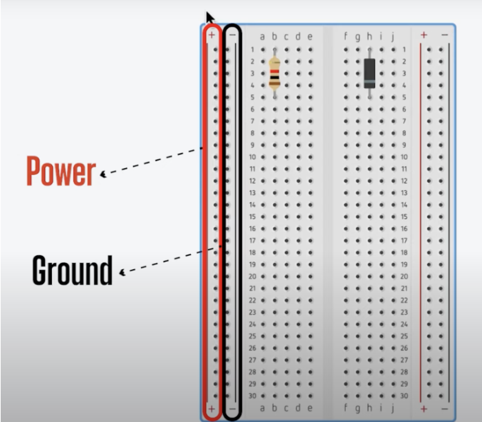
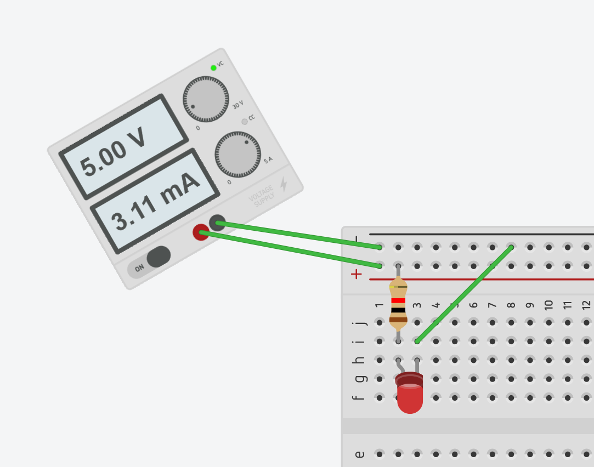
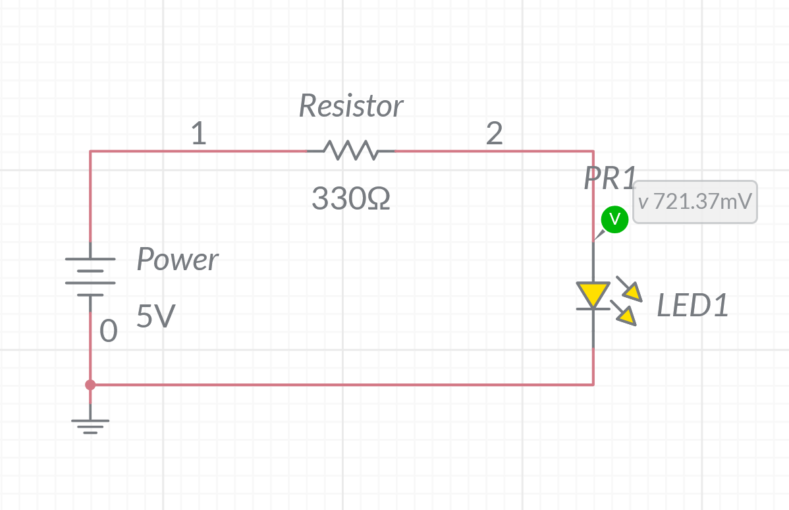
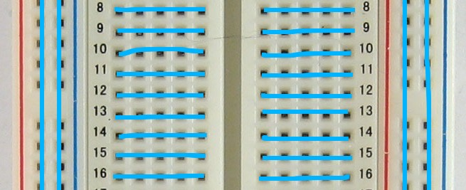
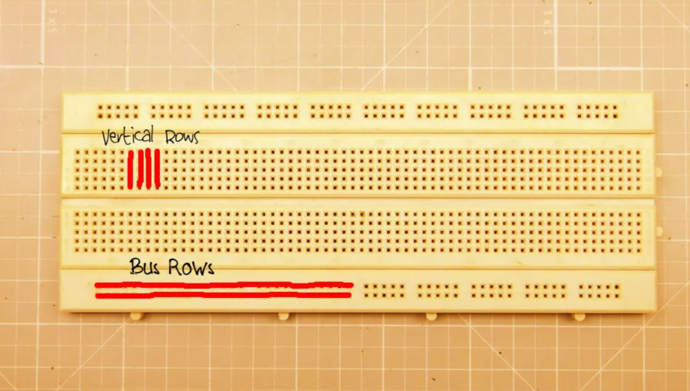
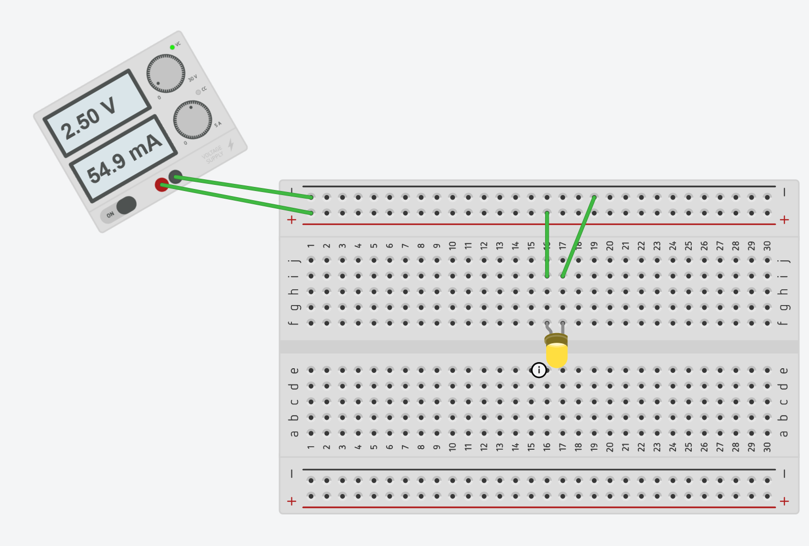
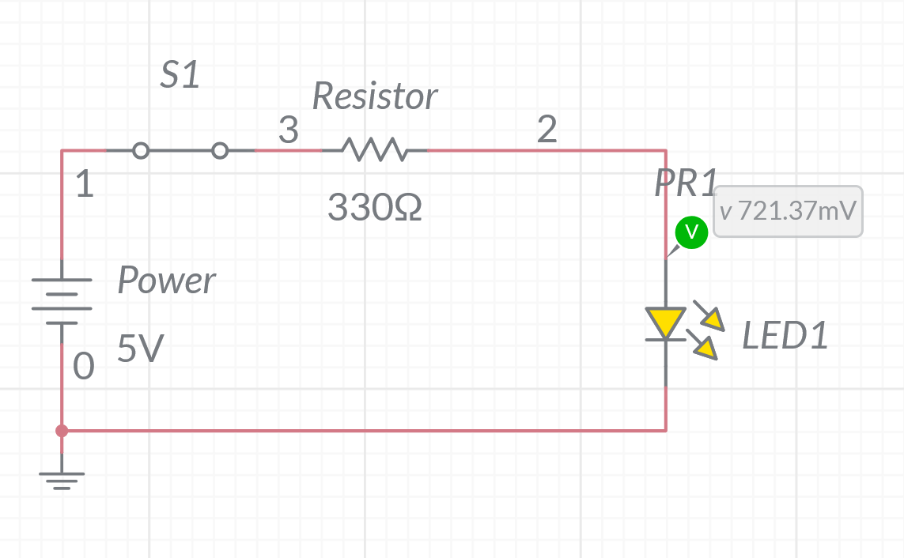
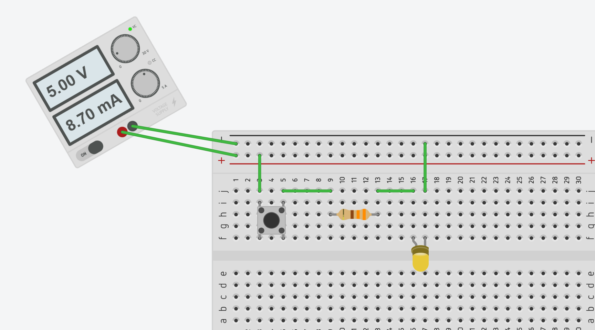
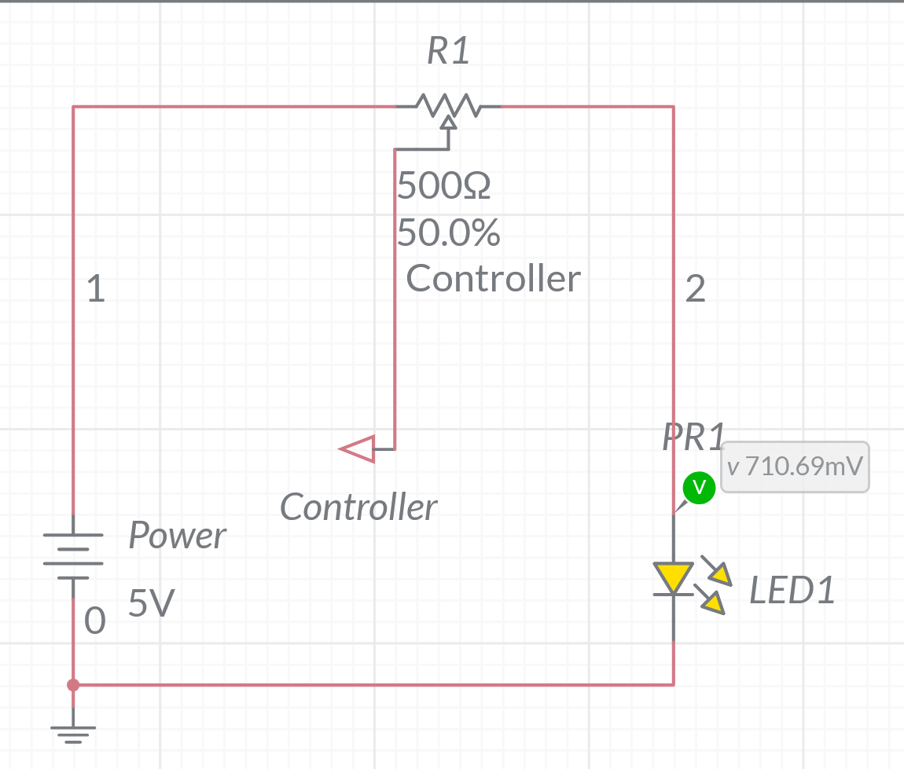
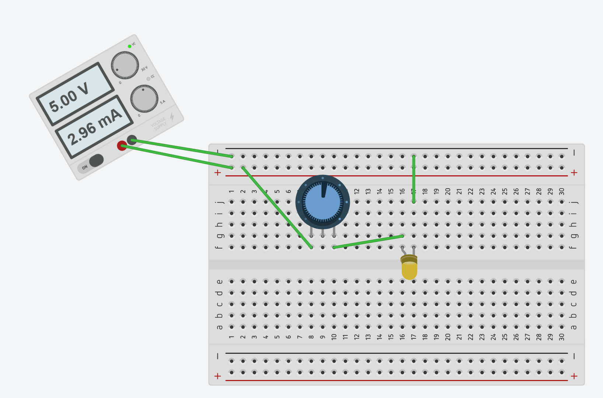

# Introduction to Breadboards  
Prepared by Christopher Gardner, B.E.E. Candidate (Expected 2028)
 
## Overview
Breadboarding is a fundamental skill used to quickly build and test electronic circuits without soldering.  In this guide I will be using Diligent Mutlisim and TinkerCAD Circuits to explain how circuits are wired together that can test configurations without risking breaking components:

https://www.multisim.com
  
and
  
https://www.tinkercad.com/circuits

We will be moving between Multisim and breadboarding throughout to explain circuitry.  We use both to test circuits cheaply and quickly.  It is NOT always realistic to use breadboards for every circuit you'll ever make but you WILL always use a simulator like Multisim. 

## Basic Electronic Components
1. Resistor: Limits the amount of electrical current flowing through a circuit.
2. Capacitor: Stores voltage and helps smooth or stabilize voltage in a circuit.
3. Inductor: More complex component used to stabilize the current into a circuit.
4. Diode: An electronic component that _only_ allows current to flow in one way (think of it like a one way road). Current flows from the _anode (+)_ to the _cathode (−)_ when the diode is connected correctly.
      5. LED: A _diode_ that emits light; current can only flow one way into this piece.
 

## Breadboard Structure
The board has a certain structure you must follow to have proper operation. The first part we will start with is the _Power Rails_ indicated by a red (power) and blue/black (ground) line running against them.
      
Connect a variable power supply or Arduino to the rails (remember both rails must have connections).  Below is a example circuit that utilizes the power rails directly; a basic LED circuit that has +5 Volts into a 330 Ohm resistor into an LED to ground, both images are the SAME however, left is TinkerCAD and right is Multisim.
 

The next idea will explore is the anatomy of the main wiring body of the breadboard. Inside the main section of the breadboard, each group of five holes in a column is electrically connected in groups (as seen below). This circuit is +2.5 Volts into a LED that then goes into ground. The 330 Ω resistor limits the current flowing through the LED so that it does not burn out.

Below is a circuit that entirely uses the wiring body anatomy as a demonstration.

 

## Basic Circuits
### 1. LED Circuit
#### Components Used
1. 330 Ohm Resistor
2. LED
3. 3 Jumper Wires

#### Simulator

#### Breadboard

### 2. Push Button LED
#### Components Used
1. Push Button
2. LED
3. 330 Ohm Resistor
4. 6 Jumper Wires

#### Simulator

#### Breadboard

### 3. Brightness Control
#### Components Used
1. Potentiometer
2. LED
3. 5 Jumper Wires

#### Simulator

#### Breadboard

## Sources
- https://www.instructables.com/Lets-Make-5-More-BreadBoard-Projects-for-Begginers/
- chatgpt, "Review this guide for breadboards that should explain concepts lightly with little to no circuit theory"

## Image Credits
- https://www.programmingelectronics.com/how-to-use-a-solderless-breadboard-with-arduino/
- https://os.mbed.com/handbook/Breadboard
