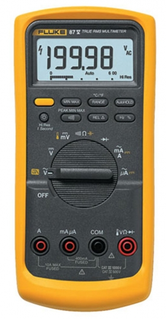

# Digital Multimeter Overview
Author: Christopher Gardner, B.E.E. Candidate 
   
One of the most important tools electrical engineers is the multimeter (DMM).  This tool always has a voltmeter (measures voltage), ammeter meter (measures current), and Ohmmeter (measures resistance); some DMM's have thermal imaging, continuity tester (checks if theres a path between two probe points), diode tester (A more advance function meant to see if a diode works correctly), and more. In this guide we will explore each tool and how to use them.

## Quick Summary of Voltage, Current, and Resistance
To understand why we even use a DMM we must unpack the three core parts of electricity.  For our purposes we will do a light summary with the anology with water pipes; think of voltage as the pressure of water, current as the flow, and resistance as a smaller pipe that limits flow.

## A Basic Layout
Below is a example multimeter. Notice the dial each has a different symbol which corrosponds to a different function. Below is a list of each function thats commonly found on each DMM.
   

  
#### 1. AC Voltmeter: This function is theoreticaly complex and will likely not be used in circuitry however, for our purposes think of it as just measuring the AC voltage across two points.

#### 2. DC Voltmeter: DC is the simplist type of current, this function directly measures the voltage across two points. On the example multimeter the mV is also a DC voltmeter just for very small voltages.

#### 4. Resistance Meter (Ohmmeter): This measures the resistance ACROSS a component or section.

#### 5. Current Meter (Ammeter)

### Sources

### Image Sources
- https://www.axiomtest.com/blog/Choosing-Between-a-Digital-Multimeter-%28DMM%29-and-an-Ohmmeter,-Ammeter,-or-Voltmeter/
- https://www.svgrepo.com/svg/503625/voltage-ac
- https://www.cs2n.org/u/badges/293/inline_content/275
- 
