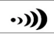
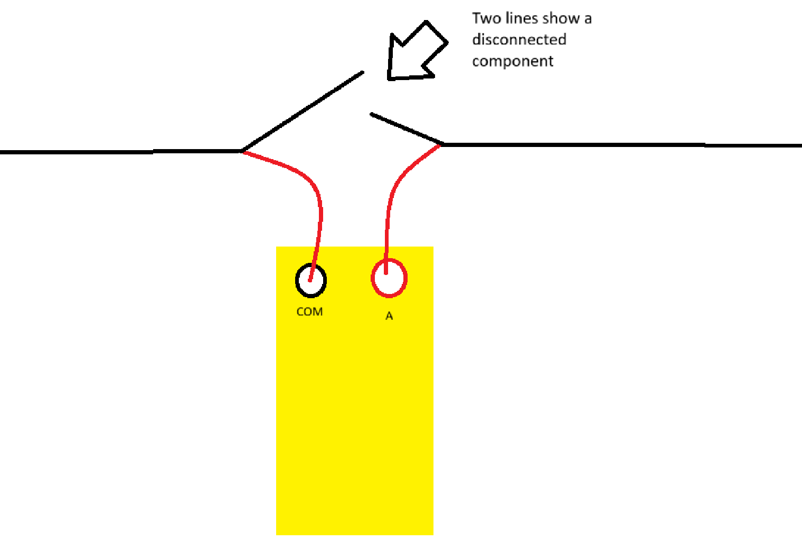

# Digital Multimeter Overview
Author: Christopher Gardner, B.E.E. Candidate 
   
One of the most important tools used by electrical engineers is the multimeter (DMM).  This tool always has a voltmeter (measures voltage), ammeter (measures current), and ohmmeter (measures resistance). Some DMM's have thermal imaging, continuity tester (checks if theres a path between two probe points), diode tester (advance tool for checking whether a diode is functioning properly), and more. In this guide we will explore each tool and how to use them.

## Quick Summary of Voltage, Current, and Resistance
To understand how to use a DMM, it helps to understand the three basic electrical quantities: voltage, current, and resistance.  For our purposes we will do a light summary with the analogy with water pipes; think of electricity like water flowing through pipes. Voltage is like water pressure, current is the amount of water flowing, and resistance is a restriction (such as a narrow pipe) that limits the flow.

## Note
An OL (Over Limit or Overload) reading means the measured value is outside the meter's current range or cannot be measured. For example, in resistance mode it often indicates an open circuit (infinite resistance), while in manual-ranging mode it may mean you need to select a higher measurement range.

## A Basic Layout
Below is a example digital multimeter. Notice that each position on the dial has a different symbol which corresponds to a different function. Below is a list of each function thats commonly found on each DMM.
   

  
#### 1. AC Voltmeter: This function measures alternating current (AC) voltage, like the voltage from a household electrical outlet. Most beginner circuits run entirely on DC.

#### 2. DC Voltmeter: DC is the simplist form of electricity, this function directly measures the voltage across two points. On the example multimeter the mV is also a DC voltmeter just for very small voltages.

#### 4. Resistance Meter (Ohmmeter): Power off the circuitry and then this measures the resistance ACROSS a component or section.

#### 5. Continuity: This tests if there is a electrical connectional in-between the two probe points.

#### 6. Diode Test: To confirm a diode is functioning correctly put the two probes and confirm a OL screen, then swap and you should get a measurement.

#### 7. Current Meter (Ammeter): To measure current we must put the probes in-series or 'break' the circuit and put the probes in places shown below.  Confirm you plug the probes into the COM and A port on the DMM.
**Warning:** Never measure voltage while the red probe is plugged into the current (A or mA) jack. Doing so can create a short circuit, blow the meter's fuse, or damage the meter.
   

## Probe Connections
1. COM- The COM port must always be connected to with our black probe.
2. A/mA/uA- Put the red probe into this port when measuring ONLY current.
3. V/Ω- Plug the red probe into this port when measuring resistance, continuity, diode tester, and voltage.

### Sources
- ChatGPT (editing), "review this guide for highschoolers guide to a DMM"

### Image Sources
- https://www.axiomtest.com/blog/Choosing-Between-a-Digital-Multimeter-%28DMM%29-and-an-Ohmmeter,-Ammeter,-or-Voltmeter/
- https://www.svgrepo.com/svg/503625/voltage-ac
- https://www.cs2n.org/u/badges/293/inline_content/275
- https://www.etechnophiles.com/multimeter-symbols-function/
