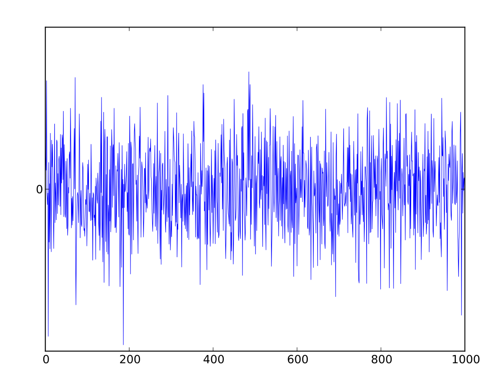
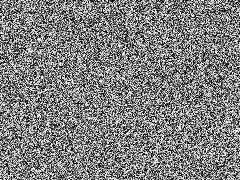
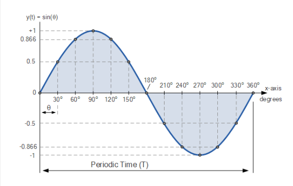
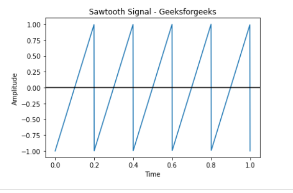
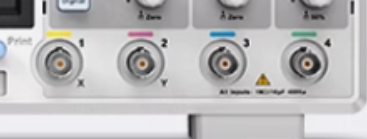
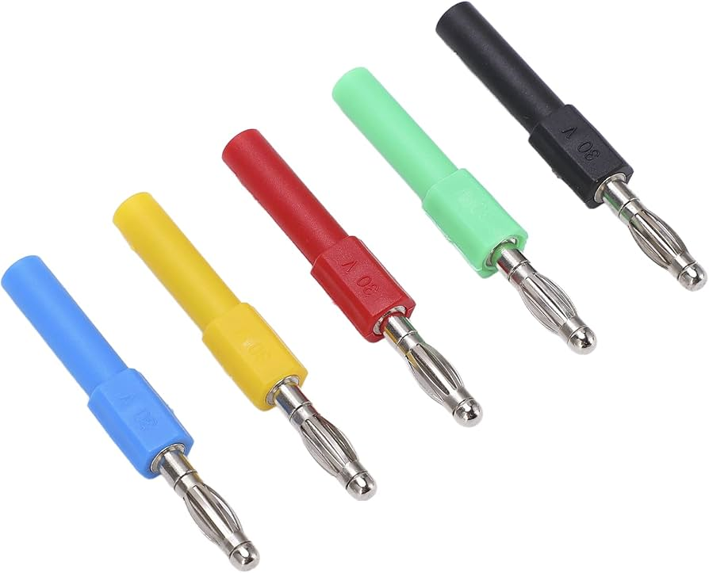
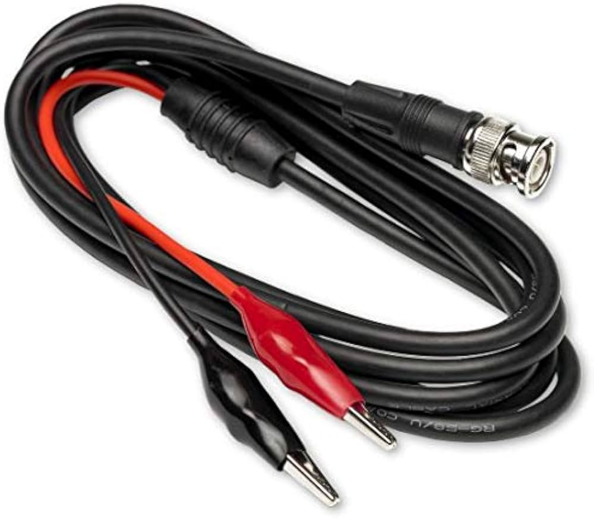

# Function Generator
Prepared by Christopher Gardner, B.E.E. Candidate (Expected 2028)   
The function generator or also known as a waveform generator (WVG), is a tool used to test how different circuits interact with different signal inputs.

## What can a function generator do?
Firstly, they can create different types of signals such as the following:

**1. Noise:** Noise is unwanted electrical signals that are added to the waveform. It can come from nearby electronics, power lines, radio signals, or the circuit itself.
 **Fun Fact:** This is what TV static is seen on the right (if your old enough to know what that is)
 

**2. Square Wave:** A common wave used for communication and testing of equipment.
  

**3. Sine Wave:** A sine wave is one of the most common waveforms you'll encounter. Household AC power is a sine wave.
  

**4. Sawtooth Wave:** Used in automobiles and control systems. This wave is not commonly used.
  

They also can adjust the _amplitude_ (height/voltage) which is useful to make sure you don't send too much or too little voltage into a circuit.

They can adjust the _frequency_ (how often the signal repeats). This is used if your circuit is for radio operations.

The generator is able to send a single 'pulse' or a repetitive wave that will repeat for a set amount of time.

A more advance function that you should not change without help of a instructor is the _phase angle_ which adjusts what part of the wave the signal starts on.

## How to connect a generator to your circuit?
To connect to your circuit you likely use either a _BNC Connector_ (left image) or less likely a _banana connector_ (right image). 
 

Then attach your probe to the appropriate test point. Please ask a instructor on where to place, wrong placement can cause fires or cause capacitors to explode.

Then select the waveform and cofiguration you'd like on the channel you are using (Channels 1 or 2).

## Sources
- https://en.wikipedia.org/wiki/Function_generator (reference)

## Image Credits
- https://www.amazon.com/Connector-Multimeter-Generators-Automobiles-Regulators/dp/B09ST46XD9
