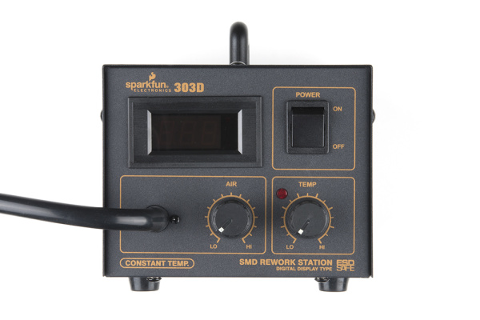
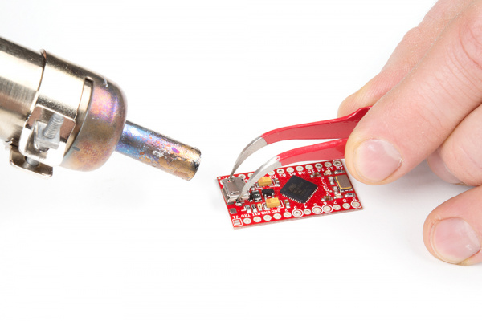

# Hot Air Reworking
Prepared by Christopher Gardner, B.E.E. Candidate (Expected 2028)  

Hot air rework is a useful technique for working with surface-mount (SMD/SMT) components, applying heat-shrink tubing, and removing components from circuit boards. It allows us to accurately join components with solder paste about a milimeter large to a circuit.

Like any soldering technique, it takes practice to use safely and effectively.

## Safety
Keep the work area clean and free of paper or other flammable materials. The nozzle becomes extremely hot, even after the station is turned off. Never point the airflow toward yourself or others, and avoid breathing solder fumes.

## How to work the machine
Before turning the station on, make sure the work area is clean and all required tools are ready. Press power on, the button should look like the one below.
 

The LED display shows temperature and air flow rate. Higher airflow moves more hot air but can blow small components off the circuit board. Lower airflow gives better control for very small parts. To adjust use the corrosponding knobs.

Changing the air flow will show a value between A25 through A99 before returning back to the temperature value.

Temperature ranges from 100-480 degrees CELSIUS.
1. SMD/SMT components:

   &#8226; use 340-380 degrees for _LEAD_
   
   &#8226; use 380-420 for _LEAD-FREE_

After selecting desired settings for each, put the nozzel about 1-2 inches away and hold the component with tweezers if placing, if removing: use tweezers to gently grip the component. Do not force it off the board. When the solder has fully melted, the component should lift away with very little force.

Move the nozzle in small circular or back-and-forth motions, similar to using a hair dryer. Avoid holding it in one place for too long.

 

## Sources
- https://learn.sparkfun.com/tutorials/how-to-use-a-hot-air-rework-station/all
