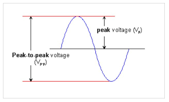
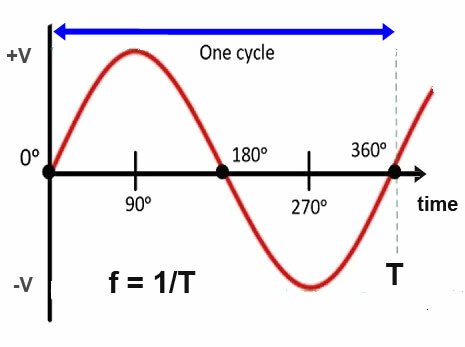
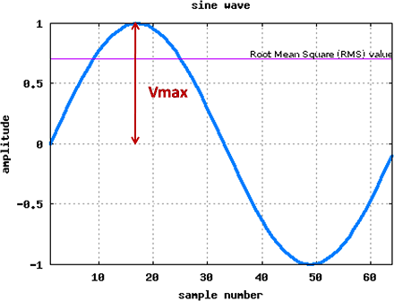
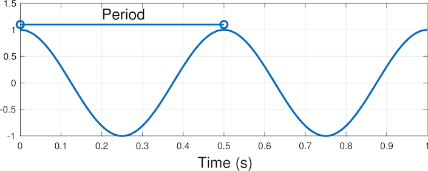
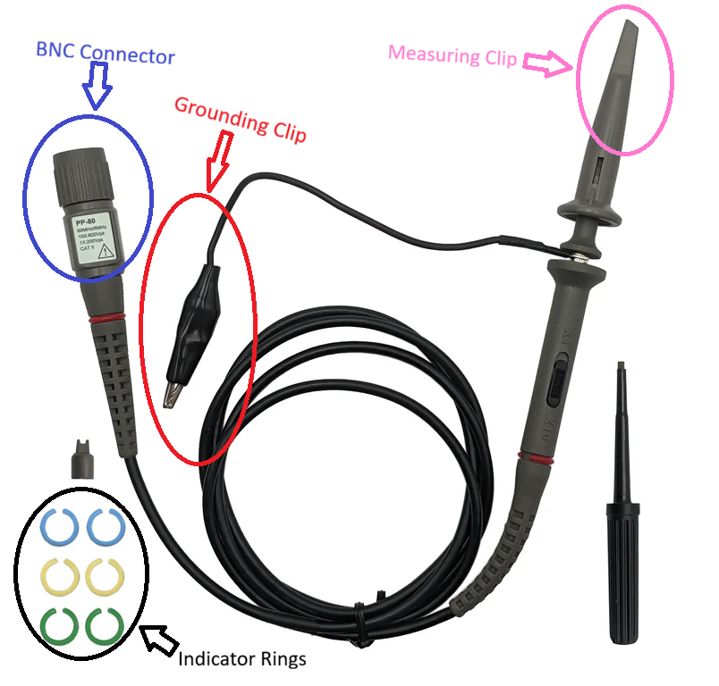
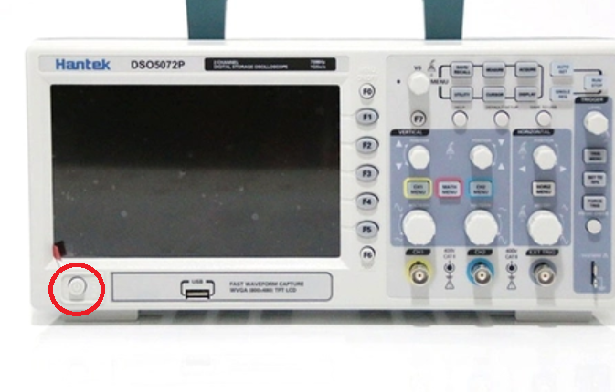
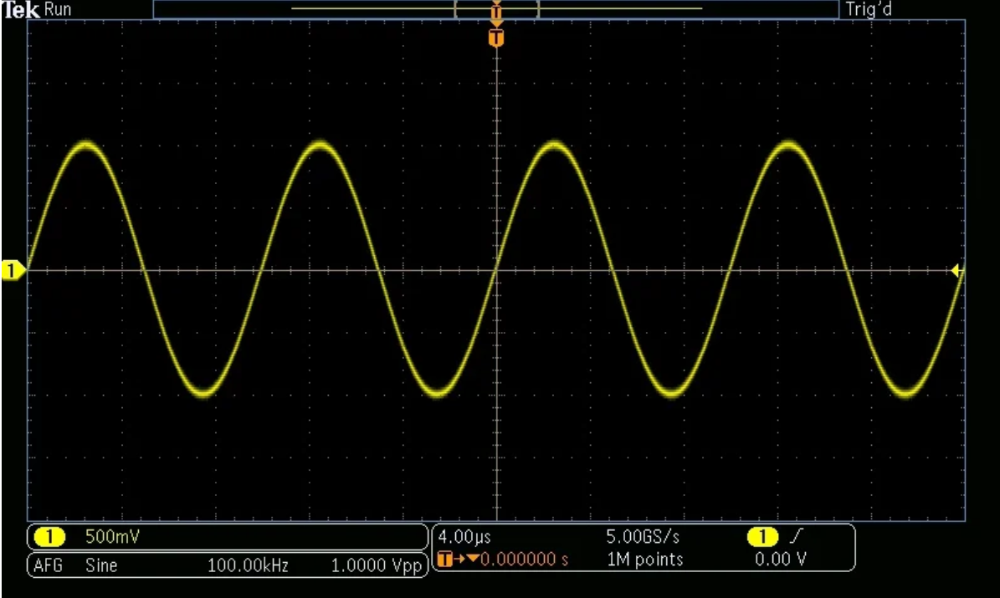
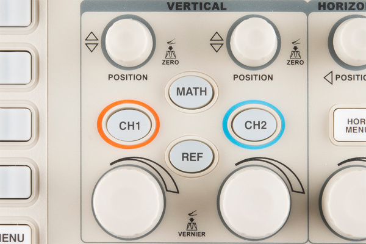
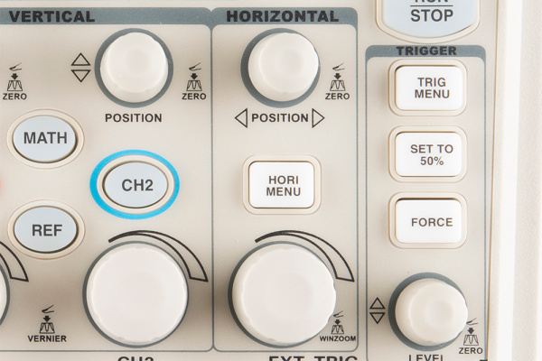
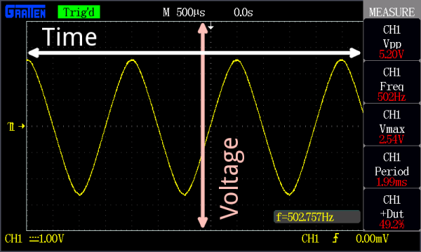

# Oscilloscope Guide
  Prepared by Christopher Gardner, B.E.E. Candidate (Expected 2028)    
One of the most important tools used by electrical and computer engineers is the oscilloscope. An oscilloscope measures voltage over time, allowing us to see electrical signals that would otherwise be impossible to observe. Digital oscilloscopes can also perform measurements like frequency (how often a signal repeats) and voltage calculations. This guide will cover the basic operation of a oscilloscope and how to use it to make simple measurements. Advanced topics such as sampling rate, bandwidth, input impedance, and transient analysis are NOT covered in this guide.

Oscilloscopes come in two main types: analog and digital. While analog oscilloscopes are still used in some specialized applications, digital oscilloscopes are the standard in most classrooms, laboratories, and industry because they can store measurements and act as advance calculators. Since our laboratory uses digital oscilloscopes, this guide will focus entirely on their operation.

## Basics
The purpose of the oscilloscope is to graph voltage over time, for accuracy of reading there are many controls that dominant the face of the machine. The tool is then designed to see frequency of a signal (how often does it repeat), if a component is causing incorrect behavior (signal isn't what we designed around), and whether the signal is DC or AC.
 
#### Terminology
##### Note: Don't be concerned if some or even all of these defintions are difficult to understand, some are very advance topics that require studying complex analysis, advance calculus, and engineering mathematics with linear algebra to fully grasp.

1. Channel: a BNC port used to connect to probes, each channel is seen as a different color in the interface. (Below)

2. Vpp: Peak to peak voltage; what this means is we measure the voltage of a AC wave from the very bottom to the very top and find the _absolute_ value (absolute is the same as magnitude; think of it as making all parts of the number positive) of the voltage.

3. Frequency: The number of times a signal wave repeats within a second. For those adept in math, frequency is defined as being solved by doing _f_=1/T (T corrosponds to the period); note that this math begins to enter euler's mathematics so don't worry about understanding the math just the simplified definition.

4. Vmax: The top peak of a signal, representing the maximum positive value a signal hits.

5. Period: How long it takes for a signal to repeat its shape. For those adept in math, it is the reciprocol of the frequency calculation: T=1/_f_ (_f_ is the frequency).

## Getting your first waveform
1. First switch on the scope (right image), connect your probe to the BNC port (whatever channel you'd like, the scope will detect whichever you use), and power on your circuit.

2. Connect the Grounding clip (above) to a common ground pin on the circuit; connect the Measuring Clip to the point you'd like to measure by pulling the retractable grey shielding back on the tip to expose the hook.

3. Press the 'start/stop' button on the top right on the oscillscope, you should see a signal on the screen appear like below (the line might look different).  If not call over a instructor for troubleshooting.

4. Gather data you need to by navigating the side measurement tools. Press button next to each tool for use.

## Vertical and Horizontal Controls
### Vertical
1. There is a section on the control pannel that says 'Vertical', these tools adjust how tall/zoom our signal looks

2. To zero your inputs press in on the button, the dial will _scale_ our signal--till you hit the scopes limits--as desired

### Horizontal
1. There is a section on the control pannel that says 'Horizontal', these tools adjust what time and also the scale of capture we look at.

## Types of signals and their meanings

## Basics of Triggering

## Sources
- https://learn.sparkfun.com/tutorials/how-to-use-an-oscilloscope/all
- https://www.tek.com/en/documents/primer/oscilloscope-basics

# Image Credits
- https://www.alibaba.com/product-detail/Siglent-The-Oscilloscope-SDS1104x-u-Features_1601418064600.html
- https://shopdelta.eu/peak-to-peak-voltage-vpp_l2_aid796.html
- https://www.weschler.com/blog/line-frequency-measurements/
- http://musicweb.ucsd.edu/~trsmyth/sinusoids171/Waveform_period.html
- https://linhkienviet.vn/may-hien-song-hantek-dso5072p-2-kenh-70mhz-digital-storage-oscilloscope
- https://www.elexp.com/products/05spak110scope-probe-bnc-ic-sw-60mhz?srsltid=AfmBOopVTEC851GlVo0Oszrdn3fSPT5a2GyvUQqfLehnmmQq34nkxUk8
